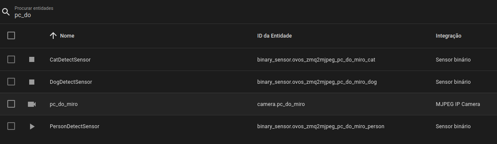

# PHAL ZMQacmera

Expose your OVOS device camera via ZMQ for remote processing via [zmq2mjpeg](https://github.com/JarbasAl/zmq2mjpeg

[zmq2mjpeg](https://github.com/JarbasAl/zmq2mjpeg integrates with:
- [ovos-PHAL-sensors](https://github.com/OpenVoiceOS/ovos-PHAL-sensors/tree/dev) - provides object detection (person / cat / dog) detection binary sensors
- Home Assistant - provides ip camera + sensors

